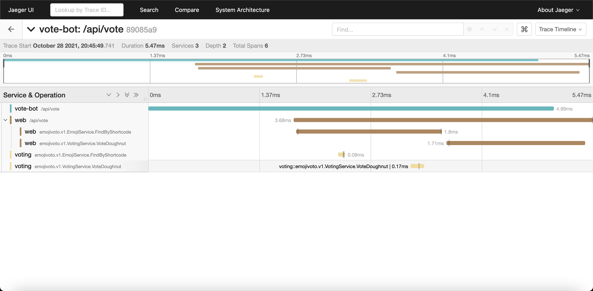
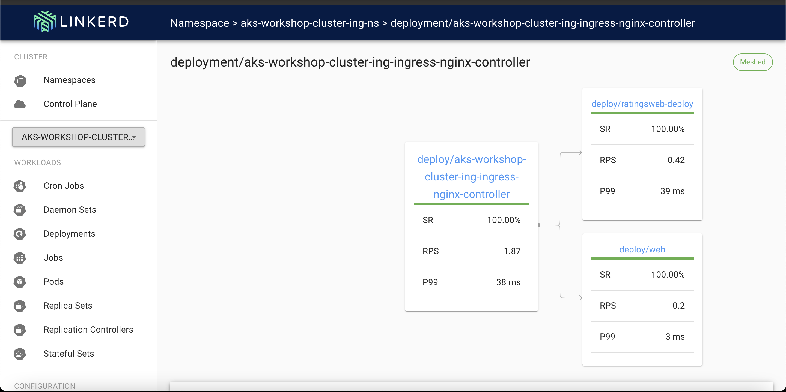

# Connected Micro services with K8s and ServiceMesh


## Introduction

## Purpose

## What to Accomplish

- ### K8s High Level Architecture

- ### AKS - High Level Architecture

- ### Understand ServiceMesh - *What it is?*

  - #### Features

  - #### Benefits

- ### Let us Delve into it

  - #### Clone Workshop repo

  - #### Plan Workshop Tasks

  - #### Create Primary AKS Cluster

    - ##### Login to Azure

    - ##### Create Primary Resource Group

    - ##### Create Service Principal

    - ##### Create Network for AKS

      - ###### Create Virtual Network

      - ###### Create Subnet for AKS cluster

    - ##### Assign Roles to Service Principal

    - ##### Create Azure Container Registry (ACR)

    - ##### Create Primary AKS cluster

    - #### Cluster Configuration

    - ### Service Mesh

      - #### Istio

        - ##### Download Istio

        - ##### Install Istio CLI - istioctl

        - ##### Configure Istio in Primary Cluster

          - ###### Install Istio onto Primary Cluster

          - ###### Inject Istio into Namespaces

          - ###### Install Kiali dashboard

          - ###### Observability

            - ###### View Basic Metrics

            - ###### View API Dependencies

          - ###### Traffic Splitting

          - ###### Fault Injection

          - ###### Distributed Tracing

          - ###### Service Mirroring

          - ###### Circuit Breaking

      - #### Linkerd

        - ##### Download Linkerd

        - ##### Install Linkerd CLI - linkerdctl

        - ##### Configure Linkerd in Primary Cluster

          - ###### Install Linkerd onto Primary Cluster

          - ###### Inject Linkerd into Namespaces

          - ###### Install Viz dashboard

          - ###### Install Jaeger for Distributed Tracing

          - ###### Observability

            - ###### View Basic Metrics

            - ###### View Detailed Metrics

              - ###### Grafana

            - ###### View API Dependencies

          - ###### Traffic Splitting

          - ###### Fault Injection

          - ###### Distributed Tracing

          - ###### Service Mirroring

      - #### API Mesh

        - ##### Azure API Managemt Service

          - ###### What it is

          - ###### How it Integrates with AKS or K8s

            - ###### Outside the Cluster

            - ###### Inside the Cluster 

            - ###### End to End view

            - ###### Application Gateway - L7 Load Balancer

          - ##### Self Hosted APIM

            - ###### Features/Benefits

            - ###### Deploy APIM

            - ###### Enable Application Insights

            - ###### Add Authentication

            - ###### Create Self Hosted Gateway

            - ###### Deploy APIM Container on AKS cluster

          - ##### Configure APIs behind APIM

            - ###### Ratings Web

            - ###### Ratings Api

            - ###### Expose APIs

              - ###### Developer Portal

          - ##### Test Integration Flow

          - ##### View API metrics

            - ###### Application Insights

          - ##### Add API Policies

            - ###### Restrict API access

              - ###### RBAC

          - ##### How it is diff from Service Mesh approach

            - ###### What is Additional

            - ###### What is missing

        - ##### Sumamry of all Appriches

          - ###### Pros & Cons

        - ##### What Next

          - ###### Multi Cluster Connectivity

          - ###### Elastic Scaling

  - ## HOL

    - ### K8s High Level Architecture

      

      

    - **AKS - High Level Architecture**

      

      

    - ### Understand ServiceMesh - *What it is?*

      

      

      - #### Features

        - Observability
        - Ingress Routing
        - Traffic Management
          - Ingress Routing
          - Traffic Splitting
          - Distruibuted Tracing
          - Service Mirroring
          - Circuit Breaking

      - #### Benefits

        - Blue/Green Deployment

        - Fault Injection

        - Multi Cluster Connectivity

        - A/B Testing

          

    - ### Let us Delve into it

      - #### **Clone Workshop repo**

        ```bash
        git clone https://github.com/monojit18/ServiceMeshWorkshop
        ```

      - #### Plan Workshop Tasks

        - Define Local variables

          ```bash
          tenantId=""
          subscriptionId=""
          location="eastus"
          clusterName="primary-mesh-cluster"
          aksResourceGroup="primary-workshop-rg"
          acrName="srvmeshacr"
          spDisplayName="http://service-mesh-aks-cluster-sp"
          aksVnetName="primary-cluster-vnet"
          aksVnetPrefix="30.0.0.0/21"
          aksVnetId=
          aksSubnetName="primary-cluster-subnet"
          aksSubnetPrefix="30.0.0.0/24"
          aksSubnetId=
          aksServicePrefix="30.0.1.0/24"
          sysNodeSize="Standard_DS2_v2"
          sysNodeCount=3
          maxSysPods=30
          networkPlugin=azure
          networkPolicy=azure
          sysNodePoolName=akssyspool
          vmSetType=VirtualMachineScaleSets
          addons=monitoring
          baseFolderPath=""
          ```
          
        - Login to Azure
        
          ```bash
          #Login to Azure
          az login --tenant $tenantId
          
          #Check Selected Subscription
          az account show
          
          #Set appropriate Subscription, if needed
          #az account set -s $subscriptionId
          ```
        
        - Create Resource Group
        
          ```bash
          #Create Resource Group for AKS workloads
          az group create -n $aksResourceGroup -l $location
          ```
        
        - Service Principal

          ```bash
          #Create Service Principal
          az ad sp create-for-rbac --skip-assignment -n $spDisplayName
          {
            "appId": "",
            "displayName": "",
            "name": "",
            "password": "",
            "tenant": ""
          }
          
          #Set Service Principal variables
          spAppId=""
          spPassword=""
          ```
        
      - #### Create Network for AKS

        - ##### **Create Virtual Network**

          ```bash
          #Deploy Virtual Network
          az network vnet create -n $aksVnetName -g $aksResourceGroup --address-prefixes $aksVnetPrefix
          aksVnetId=$(az network vnet show -n $aksVnetName -g $aksResourceGroup --query="id" -o tsv)
          echo $aksVnetId
          ```

          

        - ##### **Create Subnet for AKS cluster**

          ```bash
          #Deploy AKS Subnet inside the Virtual Network
          az network vnet subnet create -n $aksSubnetName --vnet-name $aksVnetName -g $aksResourceGroup --address-prefixes $aksSubnetPrefix
          aksSubnetId=$(az network vnet subnet show -n $aksSubnetName --vnet-name $aksVnetName -g $aksResourceGroup --query="id" -o tsv)
          echo $aksSubnetId
          
          #Assign Role to the Virtual Network
        az role assignment create --assignee $spAppId --role "Network Contributor" --scope $aksVnetId
          ```

      - #### Create Azure Container Registry (ACR) - Primary

        ```bash
        #Deploy ACR
        az acr create -n $acrName -g $aksResourceGroup --sku STANDARD --admin-enabled false
        acrId=$(az acr show -n $acrName -g $aksResourceGroup --query="id" -o tsv)
        echo $acrId
        
        #Assign Role to Service Principal for the ACR
        az role assignment create --assignee $spAppId --role "AcrPull" --scope $acrId
        ```

        

      - #### Create Primary AKS Cluster

        ```bash
        #Create Public AKS cluster
        az aks create --name $clusterName \
        --resource-group $aksResourceGroup \
        --kubernetes-version $version --location $location \
        --vnet-subnet-id "$aksSubnetId" --enable-addons $addons \
        --node-vm-size $sysNodeSize \
        --node-count $sysNodeCount --max-pods $maxSysPods \
        --service-principal $spAppId \
        --client-secret $spPassword \
        --network-plugin $networkPlugin --network-policy $networkPolicy \
        --nodepool-name $sysNodePoolName --vm-set-type $vmSetType \
        --generate-ssh-keys \
        --disable-aad \
        --attach-acr $acrName
        ```
        
        
        
      - #### Create Secondary AKS Cluster

        ```bash
        #Follow similar steps as Primary
        
        #Create CLuster from CLI or Portal
        ```

    - ### Service Mesh

      - #### Istio

        

        

        
      
        - ##### Configure AKS Cluster - Primary
      
          ```bash
          #Set Env Variable for Primary Cluster
          #This helps to switch context easily between multiple clusters
          export CTX_CLUSTER1=primary
          
          #Connect to Public AKS Cluster with Primary Context
          az aks get-credentials -g $aksResourceGroup -n $clusterName --context $CTX_CLUSTER1
          
          #Additional helpful commands
          #Switch context between multiple clusters
          kubectl config use-context <context>
          ```
      
          

        - ##### Set CLI Variables for Istio

          ```bash
          primaryResourceGroup=$aksResourceGroup
          primaryClusterName=$clusterName
          primaryAcrName=$acrName
          helmPath="/Users/monojitdattams/Development/Projects/Workshops/AKSWorkshop/ServiceMeshWorkshop/AKS/Helm"
          istioPath="/Users/monojitdattams/Development/Projects/Workshops/AKSWorkshop/ServiceMeshWorkshop/Istio"
          ```
      
        - ##### Download Istio
      
          ```bash
          #Download Istio binary
          curl -L https://istio.io/downloadIstio | sh -
          
          #The istioctl client binary in the bin/ directory
          #Add the istioctl client to your path (Linux or macOS):
          export PATH=$PWD/bin:$PATH
          ```
      
        - ##### Check Cluster Health
      
          ```bash
          kubectl get no --context=$CTX_CLUSTER1
          kubectl get ns --context=$CTX_CLUSTER1
          ```
          
        - ##### Create Namespaces
      
          ```bash
          #Create namespaces for Istio
          kubectl create namespace istio-system --context $CTX_CLUSTER1
          kubectl create namespace primary --context $CTX_CLUSTER1
          ```
      
        - ##### Install Istio CLI
      
          ```bash
          #Select Default Istio Profile settings
          istioctl install --context=$CTX_CLUSTER1 --set profile=default -y
          ```
      
        - ##### Configure Istio in Primary Cluster
      
          - ###### Inject Istio into Namespaces

            ```bash
            #Inject Istio into Primary namespace of the cluster 
            #This ensures sidecar container to be added for every dpeloyment in this namespace
            kubectl label namespace primary istio-injection=enabled --context=$CTX_CLUSTER1
            ```
      
          - ##### Install Addons
      
            ```bash
            #Install Istio Addons
            #This primarily installs all dependencies for observability by Istio viz. Grafana, Kiali dashboard etc.
            kubectl apply -f $istioPath/Components/samples/addons
            
            #Check rollout status of the Kiali deployment - usually takes sometime
            kubectl rollout status deployment/kiali -n istio-system
            
            #Launch Kiali as background process
            istioctl dashboard kiali&
            ```
      
          - ##### Observability
      
            - ###### View Basic Metrics
      
            - ###### View API Dependencies
      
            - ###### Scale Pods; view Metrics
      

          

        - ###### Traffic Splitting

          

          ```
          [TBD]
          ```

          
      
        - ###### Fault Injection

          

          ```
          [TBD]
          ```

          
      
        - ###### Circuit Breaking

        - ###### Distributed Tracing

        - ###### Service Mirroring

          

          

          

          

          ```
          [TBD]
          ```

          
      
      - #### Linkerd

        

        - ##### Download Linkerd

          ```bash
          #Export Linkerd version into an eb variable
          export LINKERD2_VERSION=stable-2.10.0
          
          #Install above version
          curl -sL https://run.linkerd.io/install | sh
          
          #Check installation status
          linkerd check --pre
          linkerd version
          ```
      
        - ##### Install Linkerd CLI - linkerdctl
      
          ```bash
          linkerd install  | kubectl apply -f -
          
          #Check installation status
          linkerd check
          ```
      
          
      
        - ##### Configure Linkerd in Primary Cluster

          - ###### Inject Linkerd into Primary Namespace

            ```bash
            kubectl get ns/primary -o yaml | linkerd inject - | kubectl apply -f -
            ```

          - ##### Install Viz dashboard
      
            ```bash
            linkerd viz install | k apply -f -
            linkerd check
            linkerd viz dashboard&
            ```
      
          - ##### Install Jaeger for Distributed Tracing
      
            ```bash
            linkerd jaeger install | k apply -f -
            linkerd jaeger check
            linkerd jaeger dashboard&
            ```
      
          - ##### Observability
      
            - ###### View Basic Metrics

              

              

            - ###### View Distributed Tracing

              

              
          
          - ###### Traffic Splitting

            
      
            ```
            [TBD]
            ```

            
          
            

          - ###### Fault Injection
      
            

            ```
            [TBD]
            ```

            
      
          - ###### Circuit Breaking

            ```
            [TBD]
            ```

            
      
          - ###### Distributed Tracing

            ```
            [TBD]
            ```
          
            
          
          - ###### Service Mirroring
          
            

  - ## References
